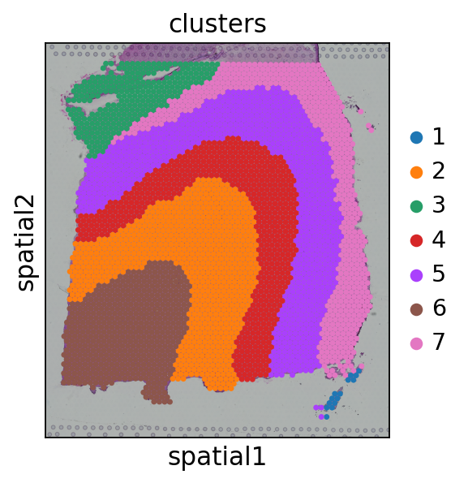

Tutorial 1: 10X Visium DLPFC dataset
====================================

.. raw:: html

    
In this tutorial, we show how to apply DiffusionST to identify spatial domains on 10X Visium data. As a example, we analyse the 151673 sample of the dorsolateral prefrontal cortex (DLPFC) dataset.

^^^^^^^^^^^^^^^^^^^^^^^^^^^^^^^^^^^^^^^^^^^^^^^^^^^^^^^^^^^^^^^^^^^^^^^^^^^^^^^^^^^^^^^^^^^^^^^^^^^^^^^^^^^^^^^^^^^^^^^^^^^^^^^^^^^^^^^^^^^^^^^^^^^^^^^^^^^^^^^^^^^^^^^^^^^^^^^^^^^^^^^^^^^^^^^^^^

.. raw:: html

    
The source code package is freely available at https://github.com/cuiyaxuan/DiffusionST. The datasets used in this study can be found at https://drive.google.com/drive/folders/1qgn2UKpu4q14ysCoCKjWYVEHXIzHNoqq?usp=drive_link.

^^^^^^^^^^^^^^^^^^^^^^^^^^^^^^^^^^^^^^^^^^^^^^^^^^^^^^^^^^^^^^^^^^^^^^^^^^^^^^^^^^^^^^^^^^^^^^^^^^^^^^^^^^^^^^^^^^^^^^^^^^^^^^^^^^^^^^^^^^^^^^^^^^^^^^^^^^^^^^^^^^^^^^^^^^^^^^^^^^^^^^^^^^^^^^^^^^^^^^^^^^^^^^^^^^^^^^^^^^^^^^^^^^^^^^^^

.. raw:: html

    
 First, cd /home/.../DiffusionST-main 

^^^^^^^^^^^^^^^^^^^^^^^^^^^^^^^^^^^^^^^^^^^^^^^^^^^^^^^^^^^^^^^^^^^^^^^^^^^^^^^^^

.. code:: ipython3

    from DenoiseST import DenoiseST
    import os
    import torch
    import pandas as pd
    import numpy as np
    import scanpy as sc
    from sklearn import metrics
    import multiprocessing as mp

.. code:: ipython3

    device = torch.device('cuda:2' if torch.cuda.is_available() else 'cpu')
    
    n_clusters = 7
    file_fold = '/home/cuiyaxuan/spatialLIBD/151673'
    adata = sc.read_visium(file_fold, count_file='151673_filtered_feature_bc_matrix.h5', load_images=True)
    adata.var_names_make_unique()

.. parsed-literal::

    /home/cuiyaxuan/anaconda3/envs/DiffusionST/lib/python3.8/site-packages/anndata/_core/anndata.py:1830: UserWarning: Variable names are not unique. To make them unique, call `.var_names_make_unique`.
      utils.warn_names_duplicates("var")

.. code:: ipython3

    model = DenoiseST(adata,device=device,n_top_genes=4096)
    adata = model.train()

.. parsed-literal::

    Begin to train ST data...

.. parsed-literal::

      0%|▏                                          | 2/500 [00:00<03:16,  2.53it/s]

.. parsed-literal::

    *********************epoch:  0 loss:  tensor(19.6874, device='cuda:2', grad_fn=<AddBackward0>)
    0
    *********************epoch:  1 loss:  tensor(18.9238, device='cuda:2', grad_fn=<AddBackward0>)
    0

.. parsed-literal::

      1%|▎                                          | 4/500 [00:01<01:41,  4.87it/s]

.. parsed-literal::

    *********************epoch:  2 loss:  tensor(16.1389, device='cuda:2', grad_fn=<AddBackward0>)
    0
    *********************epoch:  3 loss:  tensor(16.8656, device='cuda:2', grad_fn=<AddBackward0>)
    0
    *********************epoch:  4 loss:  tensor(16.5659, device='cuda:2', grad_fn=<AddBackward0>)
    0

.. parsed-literal::

      1%|▌                                          | 6/500 [00:01<01:15,  6.53it/s]

.. parsed-literal::

    100%|████████████████████████████████████████▊| 498/500 [00:47<00:00, 10.55it/s]

.. parsed-literal::

    *********************epoch:  497 loss:  tensor(8.3172, device='cuda:2', grad_fn=<AddBackward0>)
    0
    *********************epoch:  498 loss:  tensor(8.3168, device='cuda:2', grad_fn=<AddBackward0>)
    0
    *********************epoch:  499 loss:  tensor(8.3162, device='cuda:2', grad_fn=<AddBackward0>)
    0

.. parsed-literal::

    100%|█████████████████████████████████████████| 500/500 [00:48<00:00, 10.41it/s]

.. code:: ipython3

    from repair_model import main_repair
    df=pd.DataFrame(adata.obsm['emb'])

.. code:: ipython3

    main_repair(adata,df,device)

.. parsed-literal::

    /home/cuiyaxuan/anaconda3/envs/DiffusionST/lib/python3.8/site-packages/tqdm/auto.py:22: TqdmWarning: IProgress not found. Please update jupyter and ipywidgets. See https://ipywidgets.readthedocs.io/en/stable/user_install.html
      from .autonotebook import tqdm as notebook_tqdm
    Processing:   0%|                            | 1/3639 [00:03<3:55:26,  3.88s/it]

.. parsed-literal::

    50

.. parsed-literal::

    Processing:   0%|                            | 2/3639 [00:06<3:23:57,  3.36s/it]

.. parsed-literal::

    Processing:  10%|██▋                       | 369/3639 [18:30<2:45:40,  3.04s/it]

.. parsed-literal::

    50

.. parsed-literal::

    Processing: 100%|█████████████████████████| 3639/3639 [3:08:34<00:00,  3.11s/it]

.. code:: ipython3

    csv_file = "example.csv"
    data_df = pd.read_csv(csv_file, header=None)
    data_df = data_df.values
    adata.obsm['emb'] = data_df

.. code:: ipython3

    from utils import clustering
    
    radius = 50
    tool = 'mclust' # mclust, leiden, and louvain
    if tool == 'mclust':
       clustering(adata, n_clusters, radius=radius, method=tool, refinement=True)
    elif tool in ['leiden', 'louvain']:
       clustering(adata, n_clusters, radius=radius, method=tool, start=0.1, end=2.0, increment=0.01, refinement=False)
    
    df=adata.obs['domain']
    df.to_csv("label_673.csv")

.. code:: ipython3

    import matplotlib as mpl
    import scanpy as sc
    import numpy as np
    import pandas as pd
    import seaborn as sns
    import matplotlib.pyplot as plt
    import warnings
    import visual
    mpl.rcParams['pdf.fonttype'] = 42
    mpl.rcParams["font.sans-serif"] = "Arial"
    warnings.filterwarnings('ignore')
    file_fold = '/home/cuiyaxuan/spatialLIBD/151673/' # your path
    adata = sc.read_visium(file_fold, count_file='151673_filtered_feature_bc_matrix.h5', load_images=True)
    df_label=pd.read_csv('./label_673.csv', index_col=0) 
    #df_label=pd.read_csv('./label_5000.csv', index_col=0) ##If the dropout rate is less than 0.85, visualize the data using "label_5000.csv".
    visual.visual(adata,df_label)

.. parsed-literal::

    #cells after MT filter: 3639

.. parsed-literal::

    WARNING: saving figure to file figures/showvisualdomainplot_plot.pdf

